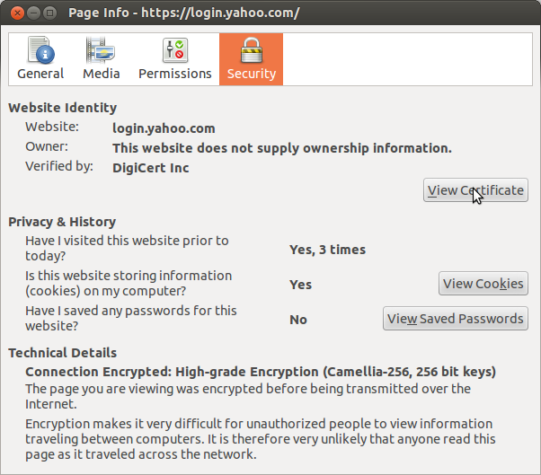
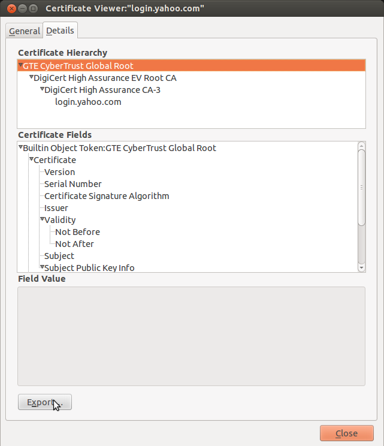

Solving SSL problems
====================

Previously we mentioned that we are ignoring ssl related errors, and that we should find a proper solution for that. These errors may happen with websites using expired / self-signed certificates, or in case our local store of certificates is empty. If we disable the ``reply.ignoreSslErrors()`` call, and try to load any website running on https, chances are good that we will get an ``SslHandshakeFailedError``. Let's actually try to trigger that error::

    class YahooDriver(BaseWebDriver):

        def __init__(self, *args, **kwargs):
            options = {'images': True, 'javascript': True}
            super(YahooDriver, self).__init__(browser_cls=Browser,
                                              options=options,
                                              *args,
                                              **kwargs)

        def step_1(self, html=None):
            print 'Loading'
            headers = {"Accept": "*/*",
                       "Accept-Charset": "ISO-8859-1,utf-8;q=0.7,*;q=0.3",
                       "Accept-Encoding": "none"}
            self.browser.make(method='get',
                              url='https://login.yahoo.com',
                              headers=headers)

You should replace the previous driver with this one in order to run it. What happens under the hood is that our browser downloads the web server's certificate, which contains the public key of the web server. A trusted certificate authority signed this certificate with their private key. Our browser should have the public keys of all the major certificate authorities in it's local store. It will use them to verify that the web server's certificate was really signed by the trusted certificate authority. The problem is, we have no certificates installed at all, so the validation fails. After running the driver, open the logfile, and somewhere near the bottom you should find something like this:::

    SSL ERROR: PySide.QtNetwork.QSslError.SslError.UnableToGetLocalIssuerCertificate - The issuer certificate of a locally looked up certificate could not be found
    SSL ERROR: PySide.QtNetwork.QSslError.SslError.CertificateUntrusted - The root CA certificate is not trusted for this purpose
    SSL ERROR: PySide.QtNetwork.QSslError.SslError.UnableToVerifyFirstCertificate - No certificates could be verified
    URL: https://csc.beap.bc.yahoo.com/yi?bv=1.0.0&bs=(135h6g1qo(gid$herC72KL7aLGDxEdgnIkiQQbXbpGjVDj_PEADCIg,st$1357118705823522,si$4465551,sp$150002529,pv$1,v$2.0))&t=J_3-D_3&al=(as$12r1ljcn9,aid$oOIzBmKL4JQ-,bi$1603559051,cr$3112176051,ct$25,at$blank-H)&s=0&r=0.7471111952327192
    STATUS CODE: None None
    ERROR: PySide.QtNetwork.QNetworkReply.NetworkError.SslHandshakeFailedError - SSL handshake failed

The solution for this is to pick our target website, load it into a regular browser (e.g. chrome or firefox), and download the site's certificate chain. Given these certificate files, we put them into a folder, and we have to add a piece of code to be ran just before starting the web driver, which should load all the certificates from the given folder and install them globally. After that point, while the application is running, wherever we create an instance of ``QNetworkAccessManager``, it will always have access to those certificates, thus the validation won't fail. However in case of expired certificates, even if you have the certificate installed, the request will still fail. Those cases should be handled manually, like regular browsers do, where they ask whether we want to accept the risk and continue using it, in which case under the hood it probably also ignores the ssl errors like we can do with ``reply.ignoreSslErrors()``, although I'm just guessing here.

These are the steps taken to get the certificates:
--------------------------------------------------

So we end up with 4 certificate files, and now that we have them, we have to write a helper function which will install them.::

    ...

    def install_certificates():
        ssl_config = QSslConfiguration.defaultConfiguration()
        ssl_config.setProtocol(QSsl.SecureProtocols)

        certs = ssl_config.caCertificates()

        for cert_filename in os.listdir(make_abs_path('certs')):
            if os.path.splitext(cert_filename)[1] == '.pem':
                cert_filepath = make_abs_path('certs', cert_filename)
                cert_file = QFile(cert_filepath)
                cert_file.open(QIODevice.ReadOnly)
                cert = QSslCertificate(cert_file)
                certs.append(cert)

        ssl_config.setCaCertificates(certs)
        QSslConfiguration.setDefaultConfiguration(ssl_config)

    ...

    if __name__ == '__main__':
        install_certificates()
        # QApplication's __init__ method accepts a list. In many places you will
        # see code snippets where sys.argv is passed to it(command line arguments),
        # but since we're not using them anyway, there's no need to pass them.
        app = QApplication([])
        driver = YahooDriver(app)
        driver.run()
        # start the famous event loop. At this point the code located after the
        # app.exec_() line will not be executed, until the event loop is cl (ed.
        app.exec_()

        print 'Application closed.'

`qttut06.py 
<https://github.com/integricho/path-of-a-pyqter/blob/master/qttut06/qttut06.py>`_.

By calling ``QSslConfiguration.defaultConfiguration``, we get access to the default global ssl configuration of *QT*, which probably contains zero installed certificates. We explicitly set the ssl protocol to ``QSsl.SecureProtocols``, which in current versions of *QT* means to use ``Tlsv1`` and ``Sslv3``.

After that, we loop through all the files in the directory containing the certificates (you can specify any path just put there the certificate files) and open those which have ``'.pem'`` extensions to add them to the list of certificates. At the end we set the modified ssl configuration as the default one, so any successive calls to it will return our modified ssl configuration.

After running the driver again, as it finished successfully the page loading, peeking into the logfile reveals that the previous error is now resolved:::

    URL: https://csc.beap.bc.yahoo.com/yi?bv=1.0.0&bs=(135q3fve4(gid$Fr90PmKL7aKr1bRpcc0XgwLDXbpGjVDkAIcACNMP,st$1357119623604841,si$4465551,sp$150002529,pv$1,v$2.0))&t=J_3-D_3&al=(as$12r4csml7,aid$ovOlIGKL4Iw-,bi$1603559051,cr$3112176051,ct$25,at$blank-H)&s=0&r=0.36311786458827555
    STATUS CODE: 200 OK

Anyone running a *Debian* family system may experience other difficulties, such as network requests never finish, ssl handshake failures even if you have the proper certificates, or ``QNetworkReply.RemoteHostClosedError`` appearing in your logfile. Older versions of ``openssl`` definitely had problems(current versions probably), I experienced them myself. This is the bug which affected me: `965371 <https://bugs.launchpad.net/ubuntu/+source/openssl/+bug/965371>`_ and even though it is fixed now, in case you are unable to update your version, a workaround is to force the usage of a different ssl protocol. In case of *QT*, this means updating our certificate installer function, specifically the line::

    ssl_config.setProtocol(QSsl.SecureProtocols)

should be replaced with::

    ssl_config.setProtocol(QSsl.SslV3)